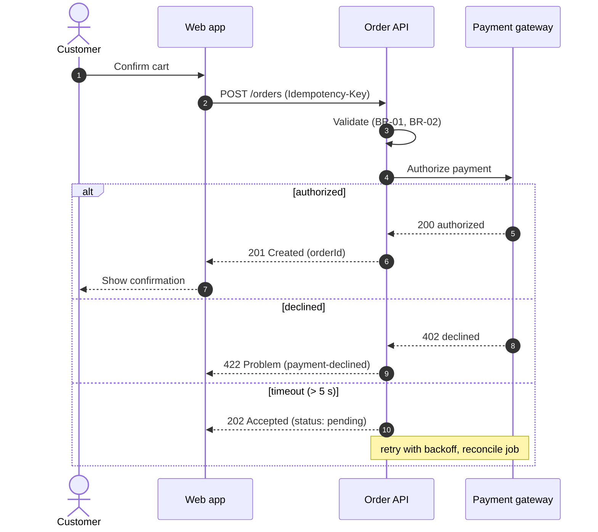

# Sequence: <interaction>

```mermaid
sequenceDiagram
  autonumber
  actor U as Customer
  participant W as Web app
  participant API as Order API
  participant P as Payment gateway
  U->>W: Confirm cart
  W->>API: POST /orders (Idempotency-Key)
  API->>API: Validate (BR-01, BR-02)
  API->>P: Authorize payment
  alt authorized
    P-->>API: 200 authorized
    API-->>W: 201 Created (orderId)
    W-->>U: Show confirmation
  else declined
    P-->>API: 402 declined
    API-->>W: 422 Problem (payment-declined)
  else timeout (> 5 s)
    API-->>W: 202 Accepted (status: pending)
    Note over API,P: retry with backoff, reconcile job
  end
```
