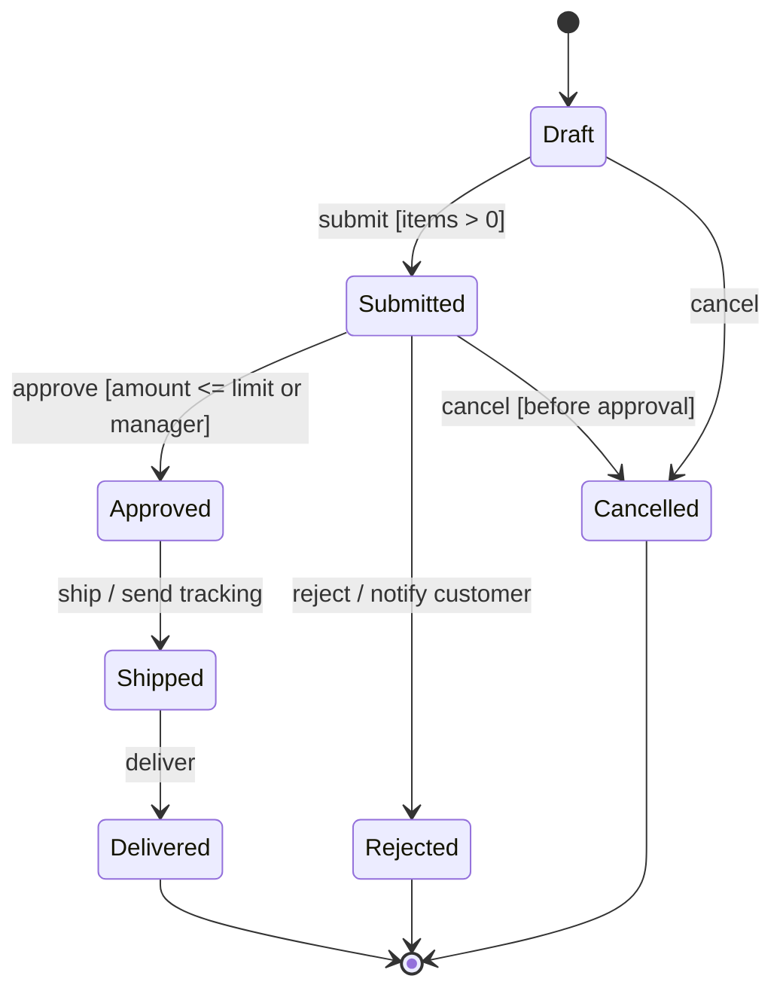

# State: <object>

```mermaid
stateDiagram-v2
  [*] --> Draft
  Draft --> Submitted: submit [items > 0]
  Submitted --> Approved: approve [amount <= limit or manager]
  Submitted --> Rejected: reject / notify customer
  Approved --> Shipped: ship / send tracking
  Shipped --> Delivered: deliver
  Draft --> Cancelled: cancel
  Submitted --> Cancelled: cancel [before approval]
  Delivered --> [*]
  Rejected --> [*]
  Cancelled --> [*]
```
| State | Meaning | Allowed actions | Who |
|---|---|---|---|
